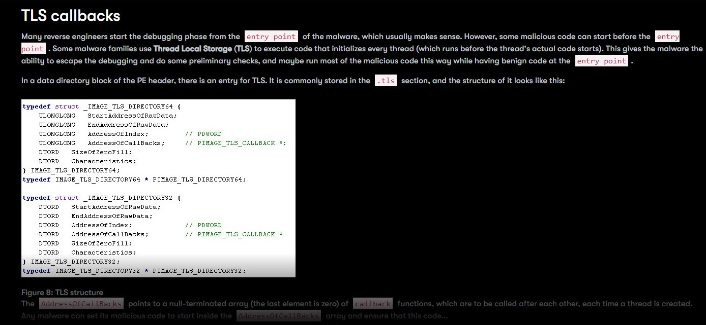

# Process Injection: Thread Local Storage

- Malicious TLS Callback
- https://www.mandiant.com/resources/blog/newly-observed-ursnif-variant-employs-malicious-tls-callback-technique-achieve-process-injection
- https://github.com/austinsonger/Incident-Playbook/blob/main/Playbooks/MITRE-ATTACK/Defense%20Evasion/T1055-Process-Injection.md
- https://www.picussecurity.com/resource/t1055-process-injection-of-the-mitre-attck-framework
- https://attack.mitre.org/techniques/T1055/005/

    * Windows API calls such as CreateRemoteThread
    * As another example, Ursnif/Gozi-ISFB malware manipulated TLS callbacks while injecting the child process
- References:
     * https://github.com/MahmoudZohdy/Process-Injection-Techniques
     * https://www.youtube.com/watch?v=CwglaQRejio
     * https://ctfcracker.gitbook.io/process-injection/process-injection-part-2 

